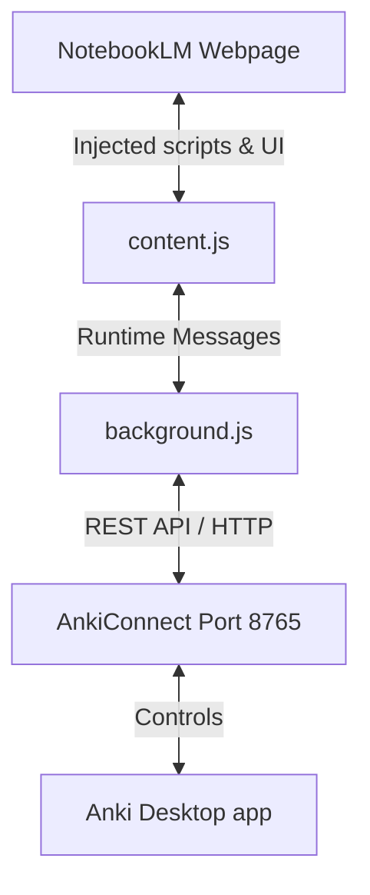

# Agent Guide: NotebookLM to Anki Extension

This document provides a comprehensive guide for AI agents and developers working on the **NotebookLM to Anki Extension** codebase. It outlines the architecture, recent major features, code style standards, and developer guidelines.

---

## 📁 Repository Structure & Architecture

The project consists of a Chrome Extension (Manifest V3) that interfaces with the desktop application **Anki** via the **AnkiConnect** API.

### 1. Chrome Extension Core (located under `./src/`)

- [manifest.json](./src/manifest.json): Configuration, permissions (`storage`, `scripting`), host permissions, and web-accessible resources.
- [background.js](./src/background.js): Service worker that handles asynchronous interactions with AnkiConnect (connection checks, deck queries, creating/deleting decks, exporting notes, and counting skipped duplicates).
- [content.js](./src/content.js): Content script injected into NotebookLM pages. It extracts the raw quiz JSON from the page (`data-app-data`), formats deck titles, manages the export workflow, and handles UI events.
- [utils.js](./src/utils.js): Shared pure utilities for HTML decoding, title sanitization, deck template substitution, error formatting, 20-field card mapping, media reference extraction, topic tag sanitization, blank answer normalization, and note deduplication.
- [button.html](./src/button.html): HTML template for the injected "Anki Export" button.
- [modal.html](./src/modal.html): HTML structure for the duplicate deck conflict resolution overlay.
- [modal.css](./src/modal.css): Stylesheet containing design tokens, animations, and layouts for the injected extension buttons and overlays.
- [popup.html](./src/popup.html) / [popup.js](./src/popup.js): Extension configuration popup.

### 2. Anki Card Templates

Located under `./src/anki_templates/` directory. These govern how the exported notes look and behave inside Anki:

- [front.html](./src/anki_templates/front.html): Frontend logic for rendering adaptive interfaces across all 4 question types (single-choice options, multi-select checkboxes, fill-in-the-blank input, and short-answer scratchpad) with inline image rendering and auto-flip mechanisms.
- [back.html](./src/anki_templates/back.html): Backend logic for evaluating answers across question types, displaying rationales for options, rendering badges and score pills, auto-grading matching fill-in-the-blank answers, and displaying model rubrics for short answer self-grading.
- [styling.css](./src/anki_templates/styling.css): Shared styling rules for card appearance, dark theme support, fonts, checkboxes, inputs, scratchpad, rubric blocks, and feedback states.

### 3. Automated Testing & Static Fixtures (located under `./tests/`)

The test suite uses Node.js 24's native test runner (`node:test` and `node:assert/strict`) with zero external runtime dependencies.

- [helpers/utils.js](./tests/helpers/utils.js): ES module adapter re-exporting shared utilities from `src/utils.js`.
- [helpers/mock-chrome.js](./tests/helpers/mock-chrome.js): Zero-dependency in-memory mock harness for Chrome Extension APIs (`chrome.storage`, `chrome.runtime`, `chrome.tabs`, `chrome.scripting`) and minimal DOM simulation for Node.js test execution.
- [fixtures/standard-quiz.json](./tests/fixtures/standard-quiz.json): Sanitized academic quiz fixtures covering basic chemistry and astronomy.
- [fixtures/multi-format-quiz.json](./tests/fixtures/multi-format-quiz.json): Sanitized multi-format quiz fixture covering all 4 question types (`multiple_choice`, `multiple_select`, `fill_in_the_blank`, `short_answer`), embedded diagrams, and topic taxonomy.
- [fixtures/math-physics-quiz.json](./tests/fixtures/math-physics-quiz.json): Mathematical formulas verifying LaTeX rendering across algebra, geometry, trigonometry, calculus, and quantum physics.
- [fixtures/edge-cases-quiz.json](./tests/fixtures/edge-cases-quiz.json): Edge-case payloads covering HTML entity escaping, missing optional hints, partial option sets, and nested query structures.
- [fixtures/raw-app-data.json](./tests/fixtures/raw-app-data.json): Synthetic payload simulating raw and HTML-escaped DOM data attributes.
- [unit/formatter.test.js](./tests/unit/formatter.test.js): Unit tests for HTML entity decoding, title normalization, deck templates, and error message formatting.
- [unit/transformer.test.js](./tests/unit/transformer.test.js): Unit tests for JSON extraction, multi-format card normalization, LaTeX preservation, and 20-field Anki payload mapping.
- [unit/deduplication.test.js](./tests/unit/deduplication.test.js): Unit tests for question text normalization, duplicate note filtering, and skipped duplicate counts.
- [unit/templates.test.js](./tests/unit/templates.test.js): Structural integrity tests verifying card HTML templates, CSS selectors, and extension manifest validity.
- [unit/background.test.js](./tests/unit/background.test.js): Unit tests for background service worker message routing, AnkiConnect HTTP requests, model creation, dynamic schema migration, media downloading, and batch export flows.
- [unit/popup.test.js](./tests/unit/popup.test.js): Unit tests for configuration popup UI initialization, settings persistence, debug toggle, and active tab script injection.
- [unit/content.test.js](./tests/unit/content.test.js): Unit tests for content script data mining, iframe messaging, UI button injection, duplicate modal workflows, and error display.
- [integration/anki-connect.test.js](./tests/integration/anki-connect.test.js): Contract integration tests with mocked network calls verifying AnkiConnect status checks, model creation, schema migration, media caching, and batch export flows (`merge`, `overwrite`, `increment`).

---

## 🚀 Key Features & Implementation Logic

### 1. Smart Duplicate Deck Handling & Modal Overlay

When exporting a deck that already exists in Anki, the extension displays an overlay modal asking the user how they would like to resolve the conflict:

- **Merge (Skip Duplicates):** Appends only new cards. Existing identical cards are skipped.
- **Auto-Increment:** Appends `(1)` (or incremental indices) to the deck name (e.g. `...Quiz | Topics (1)`).
- **Overwrite:** Completely deletes the existing deck in Anki and recreates it.
- _Note:_ Pre-flight connection checks ensure AnkiConnect is online before running the export.

### 2. Clean HTML/CSS Separation

To avoid cluttering `content.js` with stringified HTML templates and inline styles:

- HTML structures are separated into dedicated files ([button.html](./src/button.html)).
- All UI styles are defined in [modal.css](./src/modal.css).
- The script fetches the templates using `chrome.runtime.getURL()` and manages states via CSS classes (e.g. `.notebooklm-to-anki-btn-success`) instead of direct DOM manipulation.

### 3. Auto-Flip and Auto-Grading Cards

Multiple-choice cards automatically evaluate user answers and advance:

1.  **Selection (Front):** Clicking an option registers the choice (selected text and correct/incorrect flag) into `sessionStorage` and immediately flips the card using Anki's programmatic commands (`pycmd("ans")`, `showAnswer()`, or keyboard dispatch fallback).
2.  **Grading (Back):**
    - The correct option is always highlighted green (`.state-correct`).
    - If the user clicked a wrong option, it is highlighted red (`.state-wrong`), and the correct option shows a "Right answer" status header.
    - All non-selected/neutral options are slightly faded (`.state-dimmed`) but remain readable.
    - A dynamic **"Continue (Mark Correct)"** or **"Continue (Mark Incorrect)"** button is injected on the back to auto-submit grades (`ease3` for Good, `ease1` for Again) and advance instantly. Standard manual grading controls remain active.

### 4. Multi-Format Question Types & 20-Field Adaptive Schema

The extension adapts seamlessly to all 4 question types generated by Google Notebook:

- **Multiple Choice (`MULTIPLE_CHOICE`):** Standard 4-option single-choice cards with instant flip and auto-grading continue buttons.
- **Multiple Select (`MULTIPLE_SELECT`):** Checkbox selection interface on Front. Submitting flushes selected options to `sessionStorage` and flips to Back. Back shows correctness badges (`✓` / `✕`), selected indicators (`· Your answer`), explanation accordions, and a score pill (`X/Y Correct`). Auto-grades `ease3` if 100% accurate, `ease1` otherwise.
- **Fill in the Blank (`FILL_IN_THE_BLANK`):** Interactive text input on Front with Enter/Submit triggers. Back normalizes user input against `TargetAnswer` and `AcceptableAnswers` list, highlights match status, displays rationale, and injects auto-grading buttons (`ease3` for match, `ease1` for mismatch).
- **Short Answer (`SHORT_ANSWER`):** Self-study prompt with optional response scratchpad on Front. Back reveals Model Answer, expandable Required Attributes (Rubric) checklist, and Common Misconceptions to facilitate manual self-grading.

#### 20-Field Adaptive Schema:

1. `Question`
2. `Hint`
3. `Image` _(migrated non-destructively from legacy `ArchDiagram` via AnkiConnect `modelFieldRename`)_
4. `Option1`
5. `Rationale1`
6. `Flag1`
7. `Option2`
8. `Flag2`
9. `Rationale2`
10. `Option3`
11. `Flag3`
12. `Rationale3`
13. `Option4`
14. `Flag4`
15. `Rationale4`
16. `QuestionType`
17. `TargetAnswer`
18. `AcceptableAnswers`
19. `Rubric`
20. `GeneralRationale`

### 5. Media Resolution & Offline Image Caching

Diagram and source images embedded in prompts via markdown syntax (``) or direct URLs are parsed and extracted:

- Matched against `data-image-urls` to obtain the high-resolution source URL.
- During export, the background service worker calls AnkiConnect's `storeMediaFile` action to download and persist the media file into Anki's local `collection.media` folder.
- Replaces remote references with a local HTML `` tag and optional caption centered below the prompt on both Front and Back templates.

### 6. Topic Taxonomy & Dual Export Tagging

- Covered topic metadata from `topics.covered` is sanitized into valid Anki tags (converting spaces to underscores, stripping punctuation).
- Notes are assigned dual origin tags `notebooklm_export` and `google_notebook_export` alongside the sanitized topic tags for effortless filtering and deck organization.

---

## 🛠️ Code Conventions & Guidelines

When implementing changes, future agents **must** adhere to the following rules:

1.  **Code Comments & Documentation:**
    - Comment every function, method, parameter, and type.
    - Write JSDoc-formatted comments for all functions in JavaScript files.
2.  **No Direct Git Commits:**
    - Do not commit changes to Git unless explicitly requested by the user.
3.  **Modern CSS Guidelines:**
    - Maintain style hierarchy and prevent specificity collision (avoid nested overrides that trigger descending specificity selector warnings).
    - Prefer CSS variables / custom design tokens for themes.
4.  **Linter & Error Safety:**
    - Do not leave unused variables or parameter blocks in catch clauses.
    - Use modern JavaScript APIs (e.g., standard fetch, async/await patterns, optional chaining).
5.  **Automated Testing & Privacy:**
    - Run the test suite using `npm test`, `npm run test:watch`, or `npm run test:coverage`.
    - Ensure all committed test fixtures are sanitized and generic (basic chemistry, astronomy, algebra, geometry, trigonometry, calculus, physics) with zero personal or identifying information.
    - Maintain pure business logic in [`./src/utils.js`](./src/utils.js) without test-only backdoor branches in production code.
